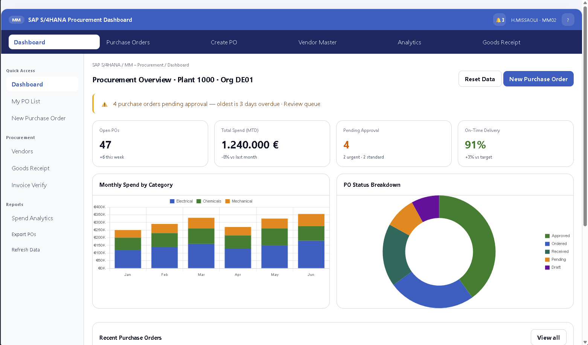

# SAP Procurement Dashboard

A complete SAP MM procurement dashboard project built with HTML, CSS, and JavaScript. It recreates SAP-style transaction screens like ME21N, ME23N, ME2M, MK03, ME2A, and MIGO using a modern browser interface.

## Features

- Dashboard overview with procurement metrics and status charts
- Purchase order list with filters, document types, and status badges
- Create PO form with dynamic line items, totals, and validation
- PO detail view with header, item lines, delivery/invoice data, and history
- Vendor master list with ratings, spend, and filters
- Spend analytics charts and export support
- Goods receipt posting workflow with confirmation and status updates
- Local storage persistence for POs and vendor records
- Keyboard shortcuts: `Ctrl+S` to save a PO, `Ctrl+G` to post goods receipt



## Getting Started

### Prerequisites

- Node.js 18+ or compatible
- npm

### Install

```bash
cd "SAP samples/sap-procurement-dashboard"
npm install
```

### Run locally

```bash
npm run dev
```

Open the local URL shown in the terminal.

### Build

```bash
npm run build
```

## Project Structure

- `index.html` — main app shell and content structure
- `src/styles.css` — SAP-inspired styling
- `src/main.js` — application logic, routing, state, and charts
- `src/data.js` — initial procurement and vendor dataset

## Notes

This is a static frontend project designed for demonstration and portfolio use. It is ready to push to GitHub as a complete demo repository.
